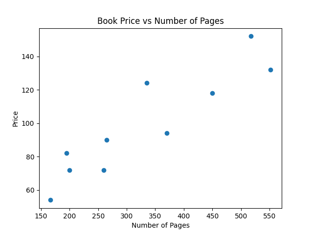
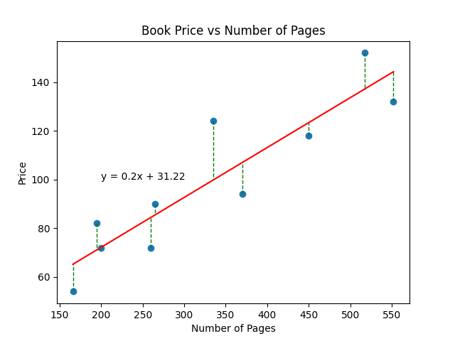

# Introduction to Linear Regression

**Author: [Mir Sazzat Hossain](https://mirsazzathossain.me/)**

## What is Regression?

Linear regression is a supervised learning algorithm that is used to predict the value of a variable based on the value of another variable. The variable we want to predict is called the dependent variable (or sometimes, the outcome variable). The variable we are using to predict the other variable's value is called the independent variable (or sometimes, the predictor variable).

For example, you could use linear regression to predict the price of a book based on its number of pages. In this case, the price of the book is the dependent variable and the number of pages is the independent variable.

## How Does Linear Regression Work?

Linear regression works by finding the best fit line for the data points. The best fit line is the line that minimizes the sum of squared errors (SSE) between the predicted values and the actual values. The predicted values are the values that are predicted by the linear function. The actual values are the values that are actually observed in the data.

The equation for the best fit line is:

$$y = mx + b$$

where $y$ is the predicted value, $m$ is the slope of the line, $x$ is the independent variable, and $b$ is the y-intercept.

The slope of the line is the change in $y$ divided by the change in $x$. The y-intercept is the value of $y$ when $x$ is equal to zero.

## Example: Predicting the Price of a Book Based on Its Number of Pages

Let's look at the example we used earlier. We want to predict the price of a book based on its number of pages. We have the following data:

| Number of Pages | Price |
| --------------- | ----- |
| 166             | 54    |
| 195             | 82    |
| 200             | 72    |
| 260             | 72    |
| 265             | 90    |
| 335             | 124   |
| 370             | 94    |
| 450             | 118   |
| 517             | 152   |
| 552             | 132   |

If we plot this data on a graph, we can see that there is a positive correlation between the number of pages and the price. This means that as the number of pages increases, the price also increases.

We can draw a line through the data points that best fits the data i.e., the line that minimizes the sum of squared errors (SSE) between the predicted values and the actual values. This line is called the best fit line.

The green dotted lines are the errors between the predicted values and the actual values. And the red line is the best fit line, which minimizes the sum of squared errors (SSE) between the predicted values and the actual values. The equation for the best fit line for this data is:

$$y = 0.2x + 31.22$$

here $0.2$ is the slope of the line and $31.22$ is the y-intercept. How did we get these values?

## How to Find the Best Fit Line?

As previously mentioned, the best fit line is the line that minimizes the sum of squared errors (SSE) between the predicted values and the actual values. Now, should we just try out different lines and see which one minimizes the SSE? No, that would be impossible. There are an infinite number of lines that we could try out. So, how do we find the best fit line?

The SSE formula looks like this:

$$SSE = \sum_{i=1}^{n} (y_i - \hat{y_i})^2$$

where $y_i$ is the actual value and $\hat{y_i}$ is the predicted value.

We want to minimize the SSE. To do that, we can take the following steps:

- Take the derivative of the SSE formula with respect to the slope $m$
- Set the derivative equal to zero
- Solve for $m$
- Take the derivative of the SSE formula with respect to the y-intercept $b$
- Set the derivative equal to zero
- Solve for $b$

To much math? Don't worry, won't go into the details of the math. We'll just give you the final formula for the best fit line:

$$m = \frac{\sum_{i=1}^{n} (x_i - \bar{x})(y_i - \bar{y})}{\sum_{i=1}^{n} (x_i - \bar{x})^2}$$

$$b = \bar{y} - m\bar{x}$$

where $\bar{x}$ is the mean of the independent variable and $\bar{y}$ is the mean of the dependent variable.

This is how we got the values for the slope and the y-intercept in the previous example.

## How to Use Linear Regression to Predict the Price of a Book?

Now that we have the best fit line, we can use it to predict the price of a book based on its number of pages. Let's say we have a book with 300 pages. We can use the best fit line to predict the price of the book:

$$
\begin{align}
y &= mx + b \\
&= 0.2(300) + 31.22 \\
&= 91.22
\end{align}
$$

So, the predicted price of the book is $91.22$.

## Conclusion

That's it! You now know how linear regression works. You can use it to predict the value of a variable based on the value of another variable. Even though we didn't go into the details of the math, we hope you now have a better understanding of how linear regression works. In the next article, we'll look at how to implement linear regression in Python. See you there!
